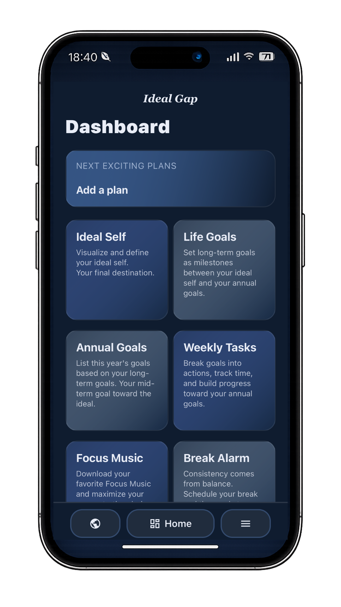
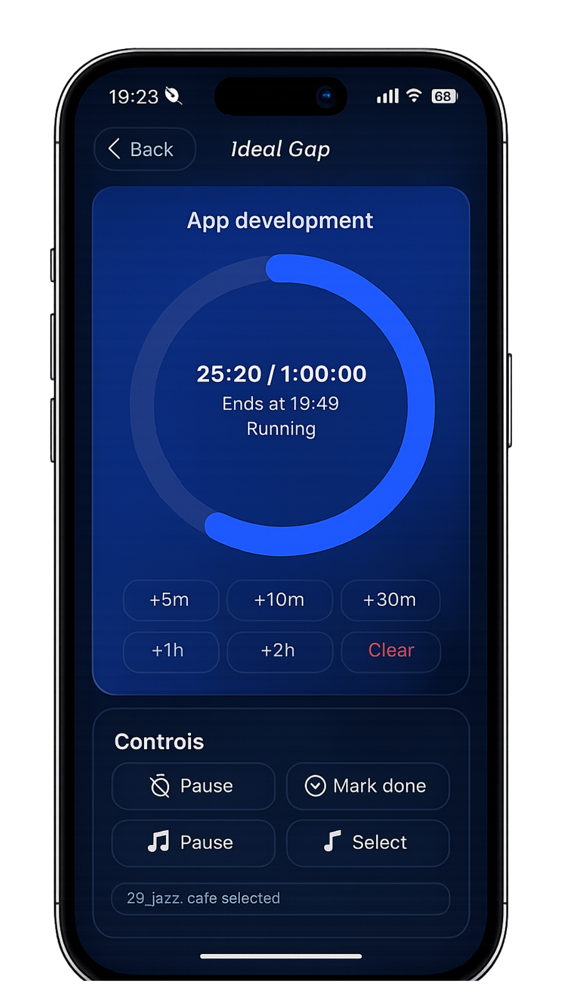
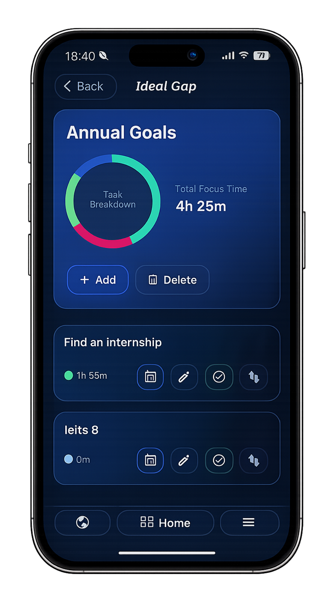

  

<h1 align="center">Ideal Gap</h1>

Bridge the gap to your ideal self.

  

<h2>Tech Stack</h2>
<strong>React Native</strong> ·
<strong>Expo</strong> ·
<strong>TypeScript</strong> ·
<strong>Supabase</strong> ·
<strong>RevenueCat</strong> · 
<strong>Sentry</strong> · 
<strong>GitHub Actions</strong>

<h2>Screenshots</h2>
  <table>
    <tr>
      <td></td>
      <td></td>
      <td></td>
    </tr>
  </table>

<h2>Overview</h2>

Ideal Gap is a cross-platform productivity app designed to help users bridge the gap between who they are today and who they want to become.Users can define their ideal self, set long-term and annual goals, break them down into weekly tasks, and stay focused with built-in focus music and a task timer.

<h2>Features</h2>
 <ul>
  <li>Set annual goals and break them into weekly tasks</li>
  <li>Stay focused with built-in focus music</li>
  <li>Track effort with a task timer</li>
  <li>Manage upcoming personal plans</li>
  <li>Support English, Japanese, and French</li>
  <li>Cloud sync with Supabase</li>
  <li>Subscription flow with RevenueCat</li>
  <li>Error monitoring with Sentry</li>
 </ul>

<h2>Project Status</h2>

Available on the App Store. Android release coming soon on Google Play.

  

